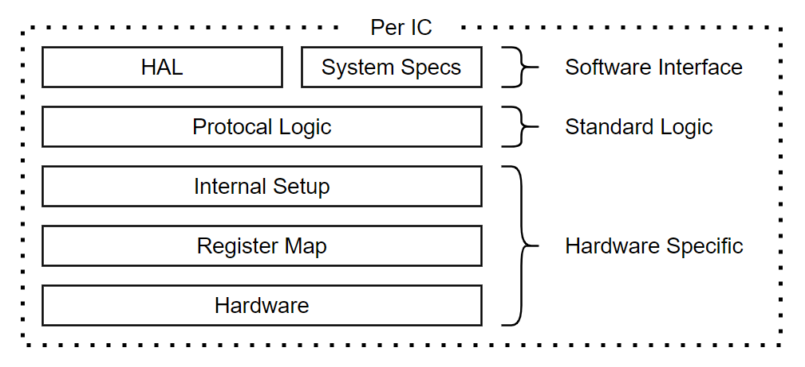

# HAL (Hardware Abstraction Layer)
HAL is used to abstract the hardware so software built ontop of it stops becomming hardware specific and rather remain as testable software. Each MCU and MPU abstracts the hardware in a standardised way such that the hardware becomes compatible with multiple softwares regardless of architecture.

## Road Map
* AVR ATmega328
* ESP32 (Wrover 32 & Wroom 23 & C3)
* ESP8266
* Teensy 4 (iMX RT1060)
* RP Pico (RP2040)