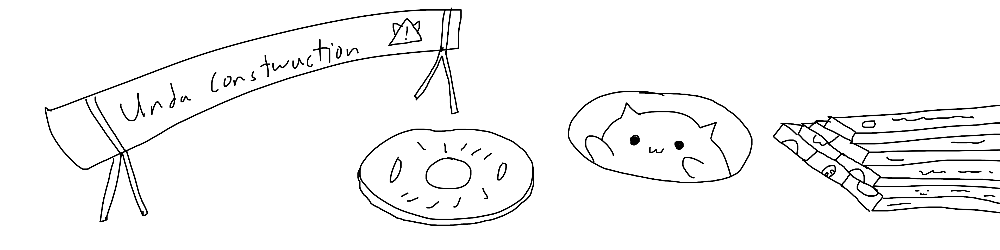

# ARCOS Library (Work In Progress)
The ARCOS library (Advanced Robotics Core Operating System), is designed to interface with mulitple hardware devices whilst providing support for hardware abstraction such that it is easily cross compatible with custom setups.

## Overview
### Status
The library is currently under development as the original ARCOS library was very rudamentory and only designed to run a simple display along with some sensors. This is an entire revamp of the system's intended purpose of being a easy to implement library similar to those of the Arduino library with substancial speed upgrades and more focused on self navigational robotics and human interface devices.

### In the works
There are many sections currently being developed including but not limited to: Actuation, Graphics, HAL, Processing and UI. This will increase in the future, however the system is currently being coded from the ground up and will take some time to develop hence why it is currently unused in some of my other projects. This will change however, once the library is mostly up and running, it will replace the mostly janky code of the such projects.

* HAL support for popular microcontroller architectures
* Allow the library to replace the system firmware for my other projects (as they are currently with its features)
* Develop the unfinished sections

## Project Timeline
### Pre-Alpha (To Dos)
* Abstraction of Pins
* Abstraction of Protocals
  * Digital
  * Analog
  * PWM
  * I2C
  * SPI
  * UART
  * Single Wire
* Interfacing of devices using abstracted protocals
  * ICM20948 (I2C)
  * BME280 (I2C)
  * 128x128 OLED
  * HUB75
  * WS2812B
  * SPI SD Card
  * INMP441 (I2C)
  * NEO 8M
* DMA Memory Management
  * Memory allocation
  * Heap allocation
* Time Management
  * Millis or Epochs since On Time
  * System Delays
  * System Timers
  * Watchdogs
### Alpha (To Dos)
* Display
  * Graphics Pipeline (From Triangles to Pixels) (Simple)
  * Vector Shaders (Simple)
  * Pixel Shaders (Simple)
  * Curve to line approximation
  * Rasterisation Engine
* Sensors
  * Sensor fusion
  * Odometry
  * Fast Fourier Transform (Audio)
* Inputs
  * Button tap combination
  * Movement gestures